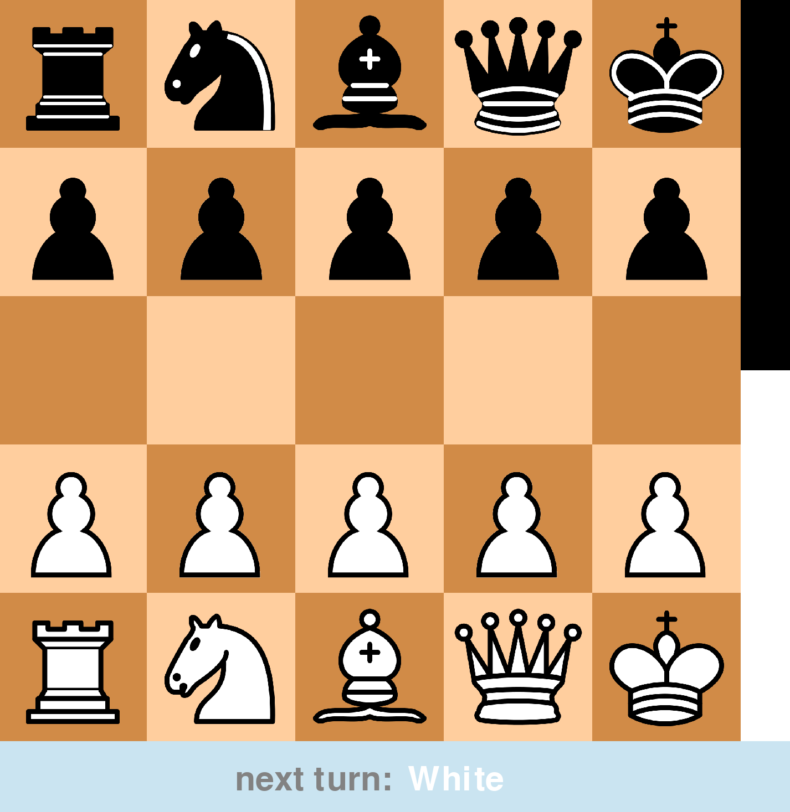
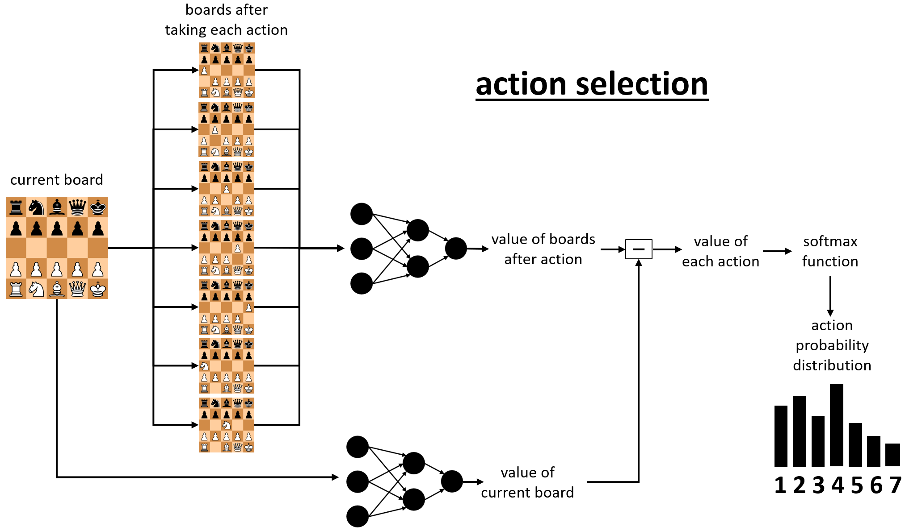
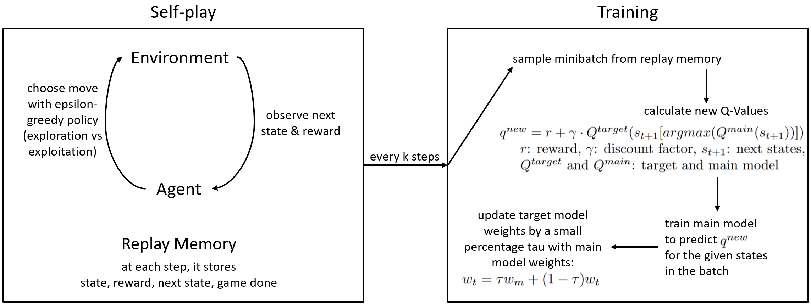
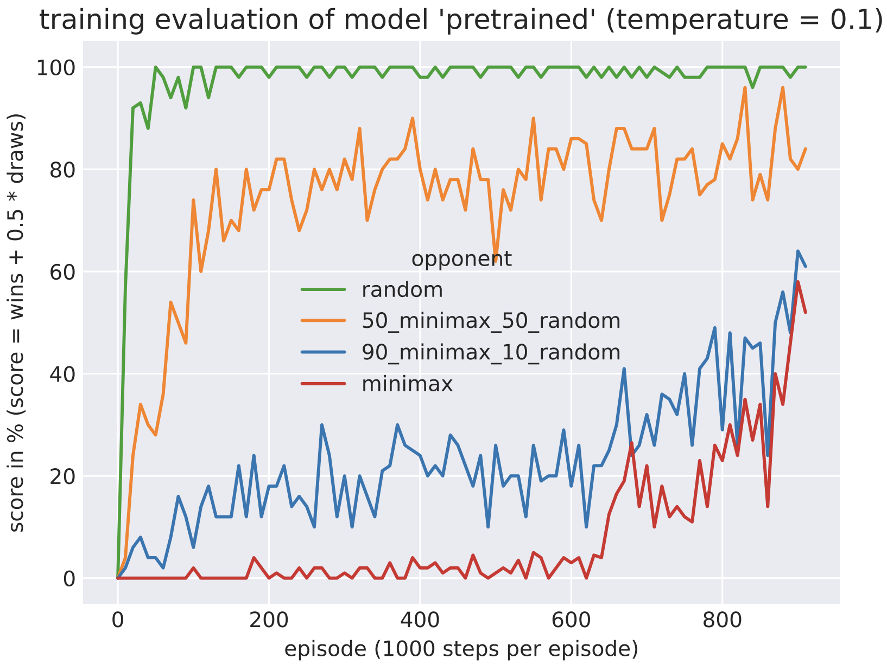
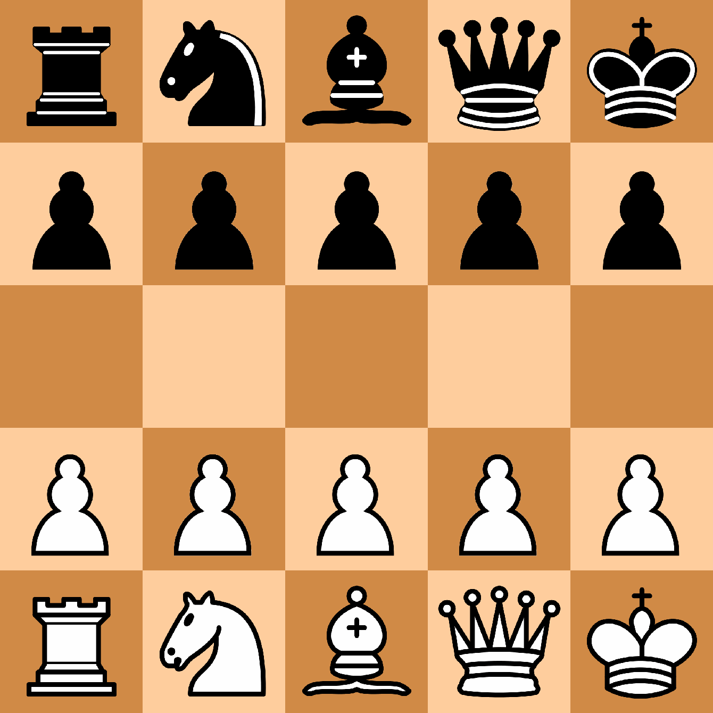

# GardnerChessAi with Double Deep Q-Learning

# Table of Contents
1. [Game Rules](#Game-Rules)
2. [Description](#Description)
    1. [How does the AI evaluate positions?](#How-does-the-AI-evaluate-positions)
    2. [Training Process](#Training-Process)
    3. [Evaluation](#Evaluation)
    4. [Example Game Against Minimax](#Example-Game-Against-Minimax)
3. [Personal Experience](#Personal-Experience)
    1. [Motivation](#Motivation)
    2. [Problems](#Problems)
    3. [Solutions](#Solutions)
4. [Installation and Usage](#Installation-and-Usage)
    1. [How to install](#How-to-install)
    2. [Packages with Versions](#Packages-with-Versions)
    3. [How to use](#How-to-use)

----
## Game Rules
Same as in normal chess, except:
- no castling
- no en passant
- pawn promotion to queen only
- king needs to be captured to win
- draw after 20 moves without a pawn move or a capture

----
## Description
This is an implementation of the [**Double Deep Q-Learning**](https://arxiv.org/pdf/1509.06461.pdf) algorithm with [**prioritized experience replay memory**](https://arxiv.org/pdf/1511.05952.pdf) to train
an agent to play the [minichess variante gardner chess](https://en.wikipedia.org/wiki/Minichess)

### How does the AI evaluate positions?
The board can be fed into a neural network in a one-hot-encoded format. The neural network is then used to predict the
value of the position (Q-value). The Q-value represents the expected reward of the agent.

Using this value, the actions can be selected as follows:

### Training Process

### Evaluation
Every few epochs, the agent plays against some preprogrammed opponents (random, minimax, etc.) to evaluate its
performance. The results are automatically plotted in a matplotlib graph and saved as a pdf under saves/modelName/gardnerChessAi_training_graph.

Here is the **training graph** of the pretrained model:

In the training evaluation, a temperature of 0.1 was used. The strength of the AI, if it always plays the
best move (with temperature 0), is of course higher. It can also be further increased by using a minimax search on top 
of the neural network evaluation (e.g. 'ai+minimax2' for a search of depth 2 on top of the neural net evaluation).

These three versions of the best model were manually pitted against minimax with the searching depths 2, 3 and 4. 
The win percentages of the AI are as follows (draw counts as half a win):
 
| Opponent  | AI with temperature 0.1 | AI with temperature 0 | AI+Minimax2 |
| --------- | ----------------------- | --------------------- | ----------- |
| Minimax 2 | 52%                     | 64%                   | 87%         |
| Minimax 3 | 37%                     | 46%                   | 59%         |
| Minimax 4 | 12%                     | 16%                   | 41%         |

As one can see, the AI is almost as good as minimax with a searching depth of 3, when it always plays the best move (temperature 0) without further search.

When using a minimax search of depth 2 on top of the neural network evaluation, the strength of the AI increases to a
point which is exactly between minimax with the searching depths 3 and 4.

### Example Game Against Minimax
Here is an example game of the pretrained model (white) playing against minimax with a searching depth of 3 (black).

----
## Personal Experience

### Motivation & Goal
This project was a hobby during my last year of school in 2022/2023. My goal was to train an AI through self-play that 
beats my family members in chess. Looking back, it was a lot of fun and I learned a lot about Q-Learning including ways 
to improve the vanilla Q-Learning algorithm and the choice of hyperparameters.

Now about a year later, I migrated to the newest tensorflow version, retrained a model with a gpu (before, I had only 
used a cpu) and made this project public.

### Problems
- instability
- exploding Q-Values
- slow training
- my time-consuming progress monitoring addiction

### Solutions
- instability
    - long enough exploration phase helped
    - checkpoints
    - **experience replay buffer** is a must-have; I also implemented a **prioritized experience replay buffer** but it 
      slowed down the training (for me, it wasn't worth it)
    - keeping Q-Values small
- exploding Q-Values
    - **Double Deep Q-Learning** instead of vanilla Q-Learning
    - continuously updating target model by a very small percentage instead of copying the weights every few epochs
    - don't have the discount factor unnecessary high
    - patience: if the Q-Values don't explode too much, they often stabilise at some point
- slow training
    - exponential decaying learning rate
    - **gpu** training instead of cpu-only training
    - time different parts of the training process and optimize the most time-consuming parts. For me, this was:
      - directly calling model() instead of model.predict() to get the Q-Values extremely sped up training and
        interference (in get_q_values() methode in neural_network.py)
      - minimizing model() calls by batching inputs in the fit_on_memory() methode in training.py
    - with these optimizations, I was able to decrease the epoch time from 2 minutes to 7 seconds while at the same time
      increasing the batch size from 32 to 128 and increasing the fitting frequency from 8 to 16
- my time-consuming progress monitoring addiction
    - partially solved by a fully automated training and evaluation process which includes saving, remembering and reloading training settings,
      making checkpoints, pitting the agent against different opponents, updating the training graph
----
## Installation and Usage

### How to install
- clone the repository
- install the dependencies (if you have conda and want to use a gpu (only possible on wsl2/linux), you can use the gardnerChessAi.yml file with the terminal command 
`conda env create -f gardnerChessAi.yml` to create a conda environment with all the dependencies)

### Packages with Versions
- tensorflow=2.15.0.post1
- numpy=1.26.2
- matplotlib=3.8.3
- pygame=2.5.2
- python=3.11.5

### How to use
- run training.py to train a model (you can train you own model or continue training the pretrained model)
- training evaluation can be followed in matplotlib plots under saves/modelName/gardnerChessAi_training_graph
- run play.py to play against a model or watch two models play against each other
- run spectate.py to see how the agent improved the play style over the epochs
- in the scripts are more detailed explanations and options to choose from
